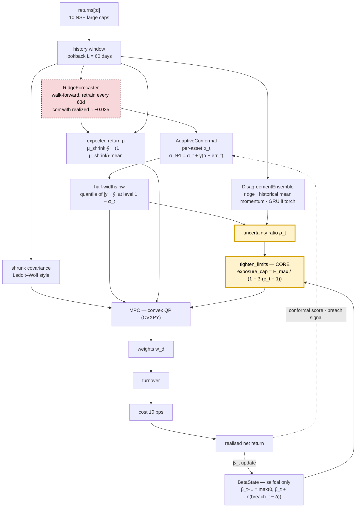

# conformal-mpc-portfolio

Conformal-calibrated robust MPC for risk-aware portfolio allocation.

A learned return forecaster feeds adaptive conformal prediction intervals; those intervals
drive **uncertainty-dependent constraint tightening** inside a CVXPY model-predictive
controller, which re-solves a convex programme every trading day. When forecast uncertainty
spikes, the risk limits tighten automatically.

> **The honest headline: this paper does not show that forecasting helps.** The daily ridge
> forecaster has no measurable skill on these assets (mean per-asset correlation with
> realized returns ≈ −0.035). What the conformal + tightening + regime layer demonstrates is
> narrower and, we think, more useful: *it makes an unreliable forecaster safe to put in the
> loop.* A stronger, much simpler baseline (volatility-targeted equal weight) matches or beats
> the full controller on tails. See [What this does not show](#what-this-does-not-show).

---

## Table of contents

- [Quick start](#quick-start)
- [The pipeline](#the-pipeline)
- [Data and splits](#data-and-splits)
- [The strategy ladder](#the-strategy-ladder)
- [Results](#results)
- [Stress-conditional analysis](#stress-conditional-analysis)
- [Self-calibration ablation](#self-calibration-ablation)
- [What this does not show](#what-this-does-not-show)
- [Bugs found and fixed](#bugs-found-and-fixed)
- [How the study was built, step by step](#how-the-study-was-built-step-by-step)
- [Repository layout](#repository-layout)
- [Reproducing](#reproducing)
- [Project rules](#project-rules)

---

## Quick start

```bash
make setup && source .venv/bin/activate

make test        # 67 tests
make synthetic   # offline smoke test on SIMULATED data — never reportable
make val         # real NSE data (10 tickers), validation period 2016–2019
```

`make synthetic` exists so the suite runs with no network. Its output must never appear in
the paper; `AGENTS.md` rule: *reported numbers come from real NSE prices only.*

---

## The pipeline



The full diagram — including the regime layer, the execution path, and the complete
feedback loop — lives in [`docs/flow.mmd`](docs/flow.mmd) as editable Mermaid source,
with a rendered copy at `docs/figures/flow.svg`.
`tests/test_figures.py` checks that the node ids there still match the seven blocks in
`docs/figures/block_diagram.png`, so the two renderings cannot silently drift apart.

**Core mechanism — `tighten_limits` in `src/mpc.py`.** Given an uncertainty ratio `ρ_t ≥ 1`
(half-widths relative to their trailing median), the exposure and volatility caps are shrunk:

```
exposure_cap_t = max_exposure · 1 / (1 + β·(ρ_t − 1))
```

`β` is the tightening strength. `mpc_fc_tight` uses a fixed `β`; `mpc_selfcal` *learns* `β_t`
online from realized breaches. Higher uncertainty ⇒ lower cap ⇒ smaller positions ⇒ less
drawdown risk. The optimisation stays a convex QP.

**Tail-risk budget — `mpc_tailbudget`, the paper's title mechanism.** `tighten_limits` shrinks
a *mean* exposure cap, which is a blunt instrument: it does not distinguish a mild drawdown
from a tail event. `mpc_tailbudget` instead caps the **CVaR of the daily loss** directly, using
the Rockafellar–Uryasev epigraph (Rockafellar & Uryasev 2000) over a fixed Gaussian scenario
set:

```
budget_t = vol_mult · σ_t · 1/(1 + β_t·(ρ_t − 1))          σ_t = trailing equal-weight vol
CVaR_α( loss ) ≤ budget_t                                  α = 0.05, 200 scenarios
```

The epigraph is imposed as a **constraint** with `η` free, so it adds only linear constraints
and the problem stays a **QP** (the scenarios are fixed draws, making the loss linear in `w`).
The same learned `β_t` and uncertainty ratio `ρ_t` that shrink the exposure cap instead shrink
the *tail* budget. `vol_mult = 1.6` is TRAIN-calibrated: realized CVaR/vol is ~2.0–2.17, so the
constraint is **live** at full investment (binds on 54% of days) rather than permanently slack.
See `docs/experiment_log.md` for the three silent bugs this took.

**Adaptive conformal prediction (`src/conformal.py`).** Gibbs & Candès (2021) ACI. Per-asset
miscoverage adapts online, `α_{t+1} = α_t + γ(α − err_t)`, so the interval widens on assets
where the model keeps being wrong and narrows where it is calibrated.

---

## Data and splits

| | window | trading days | use |
|---|---|---|---|
| train | 2012-01-03 → 2015-12-31 | 982 | fitting, threshold estimation |
| **validation** | **2016-01-01 → 2019-12-31** | **983** | **all reported numbers** |
| test | 2020-01-01 → | — | **sealed — never read** |

Real adjusted-close prices for 10 NSE large caps, 2012-01-02 → 2025-12-30, cached in
`data/raw/` (git-ignored; re-downloadable). One-way transaction costs **10 bps**, applied in
every backtest including baselines. Seed **42**; 252 trading days/year.

Every hyperparameter lives in `configs/default.yaml`. There are no magic numbers in code.

**Splits are a governance artifact, not a convenience.** `experiments/run_all.py` refuses
`--period test` unless invoked with an explicit `--final` instruction. No command in this
repository has ever run on the test period.

---

## The strategy ladder

Each rung adds exactly one element, so its contribution is measurable. `ALL` in
`experiments/run_all.py` is the source of truth.

| strategy | what it adds |
|---|---|
| `equal_weight` | 1/N, rebalanced |
| `buy_hold` | buy at the start, never touch |
| `markowitz` | mean–variance, shrunk covariance |
| `equal_weight_voltarget` | 1/N scaled to a 10% vol target, 60d |
| `mpc_naive` | MPC, no forecast, no conformal, no tightening |
| `mpc_dd_riskaversion` | MPC + drawdown-adaptive risk aversion |
| `mpc_fc` | + forecaster |
| `mpc_fc_robust` | + κ-penalised worst-case μ |
| `mpc_fc_tight` | **+ uncertainty-driven tightening (core)** |
| `mpc_selfcal` | learned `β_t` + ensemble disagreement |
| **`mpc_tailbudget`** | **+ hard CVaR(5%) tail-risk budget (title mechanism)** |
| `mpc_tailbudget_nofc` | the same, **forecast removed** — isolating control |
| `mpc_full` | + regime layer |

---

## Results

Validation period 2016-01-01 → 2019-12-31, 983 days, costs on. Sharpe/CVaR/max-drawdown
intervals are 95% stationary block bootstrap (2000 resamples, mean block 10 days), seed 42.

| strategy | Sharpe | 95% CI | CVaR 5% | maxDD |
|---|---|---|---|---|
| `equal_weight` | 1.385 | [0.41, 2.35] | −0.0172 | −13.1% |
| `buy_hold` | 1.325 | [0.34, 2.30] | −0.0170 | −13.1% |
| `markowitz` | 0.967 | [−0.01, 1.94] | −0.0199 | −15.6% |
| **`equal_weight_voltarget`** | 1.302 | [0.26, 2.32] | **−0.0131** | **−10.7%** |
| `mpc_naive` | 1.252 | [0.29, 2.23] | −0.0170 | −15.5% |
| `mpc_dd_riskaversion` | 1.103 | [0.11, 2.14] | −0.0158 | −15.2% |
| `mpc_fc` | 1.124 | [0.17, 2.10] | −0.0171 | −15.6% |
| `mpc_fc_robust` | 1.115 | [0.14, 2.11] | −0.0170 | −15.5% |
| `mpc_fc_tight` (core) | 1.073 | [0.11, 2.07] | −0.0163 | −14.6% |
| `mpc_selfcal` | 1.091 | [0.12, 2.09] | −0.0166 | −15.2% |
| **`mpc_tailbudget`** | **1.196** | [0.21, 2.20] | **−0.0150** | **−14.6%** |
| `mpc_tailbudget_nofc` | 1.265 | [0.23, 2.30] | −0.0148 | −14.7% |
| `mpc_full` | 1.160 | [0.18, 2.16] | −0.0151 | −13.6% |

**No Sharpe difference is statistically significant.** Bootstrap Sharpe noise is roughly ±0.9;
every observed gap is 0.1–0.4. The significant effects are all in risk:

- `mpc_full` − `mpc_naive`: CVaR **+0.002**, paired bootstrap `p = 0.001`. The core layer helps
  *within* the MPC family.
- `mpc_tailbudget` − `mpc_selfcal`: CVaR **+0.0016**, paired bootstrap `p = 0.001`
  (CI [0.0010, 0.0021]). These two differ by exactly one line — a hard CVaR budget in place
  of a scalar exposure cap — so this is the cleanest evidence that *targeting the tail
  specifically* beats shrinking the mean. Sharpe (+0.11, p = 0.24) and maxDD (p = 0.18) do not
  differ significantly.
- versus `equal_weight_voltarget`, `mpc_fc_tight` is **worse** on CVaR (p = 0.004), and
  `mpc_tailbudget` is still behind it (diff −0.0019, **p = 0.082**, not significant). The
  simple volatility-targeted baseline remains the hardest thing to beat on tails.

**The forecaster is a drag, and we can now prove it.** `mpc_tailbudget_nofc` is
`mpc_tailbudget` with exactly one change: `_blend_mu` returns the historical mean instead of
the forecast. It keeps the budget, `beta_t`, the ensemble, the scenarios, and the costs.

| nofc vs … | CVaR diff | p | Sharpe diff | p |
|---|---|---|---|---|
| `mpc_tailbudget` (forecast on) | +0.00025 | 0.61 | +0.069 | 0.62 |
| `mpc_selfcal` (exposure cap) | **+0.00185** | **0.001** | +0.174 | 0.17 |
| `equal_weight_voltarget` | −0.0017 | 0.14 | −0.037 | 0.95 |

Removing the forecast changes **nothing** statistically (every p > 0.6) while cutting turnover
4× (0.036 → 0.009) and cost 4× (3.54% → 0.89%). So the forecaster contributes nothing here
except cost — and the one significant effect remains budget-vs-exposure-cap on the tail. But
even with the forecast removed, the MPC stack **still does not significantly beat
`equal_weight_voltarget`** on CVaR (p = 0.14), Sharpe (p = 0.95), or maxDD (p = 0.84).

**Conformal calibration works.** ACI empirical coverage is **0.8984** against a 0.90 target on
this validation window; per-asset `α_t` settles in [0.066, 0.121] around a mean of 0.0925.

---

## Stress-conditional analysis

Conditioning on an **independent** stress label, defined in `docs/stress_definition.md` and
fitted on train only:

```
stress_t  =  (cross-sectional dispersion_t ≥ train p80 = 0.01761)
         OR (equal-weight market return_t ≤ train q10 = −0.01079)
```

60-day warmup; runs separated by ≤2 calm days merged; episodes shorter than 3 days dropped.
This shares **no statistic** with `src/regime.py`'s `VolRegimeDetector` (Jaccard overlap 0.166)
— the first draft of this analysis used that same detector, which made the labels circular and
the whole exercise meaningless. Drawdown-from-running-peak was also tried and **rejected**: it
is sticky, collapsing into one 194-day "episode" across the 2015–16 bear market.

448 stress days (22.8%) in 83 episodes across train+val. In validation: 750 calm, 232 stress.

| strategy | CVaR calm | CVaR stress | worst stress day |
|---|---|---|---|
| **`equal_weight_voltarget`** | −0.008 | **−0.019** | **−0.032** |
| `mpc_naive` | −0.012 | −0.028 | −0.044 |
| `mpc_fc` | −0.011 | −0.029 | −0.046 |
| `mpc_fc_tight` | −0.011 | −0.026 | −0.044 |
| `mpc_selfcal` | −0.011 | −0.026 | −0.044 |
| **`mpc_tailbudget`** | **−0.010** | **−0.023** | **−0.039** |
| `mpc_full` | −0.010 | −0.024 | −0.042 |

Mean gross exposure across all 83 episodes: `equal_weight` 1.000, `mpc_naive` 0.909,
`mpc_selfcal` 0.871, `mpc_tailbudget` 0.84, `mpc_fc_tight` 0.862, `mpc_full` 0.810,
`equal_weight_voltarget` 0.734.
Exposure does **not** dip further at +10d/+20d than at episode start — de-risking here is a
standing posture, not a reaction, because the conformal signal moves slowly.

---

## Self-calibration ablation

`mpc_selfcal` (`src/selfcal.py`) learns the tightening strength instead of fixing it:

```
breach_t   = 1{net_return_t < −0.02}
β_{t+1}    = max(0, β_t + η(breach_t − δ)),    η = 0.05, δ = 0.01
```

It also builds a forecaster ensemble (ridge, historical mean, momentum, GRU if torch is
installed) and measures cross-model disagreement. The tightening signal is the **geometric
mean** of the conformal-width ratio and the disagreement ratio, each divided by its own
trailing median — deliberately conservative, since it moves only when both arms move together.

**The calibration worked; the performance effect did not.**

- realized breach frequency **0.0112** against target `δ = 0.01` (0.0119 over the last 250 days)
- `β_t` mean 0.097, peak 0.322, final 0.249 — engaged and stayed engaged
- mean exposure cap **0.9908** (min 0.850) — almost nothing to tighten
- mean uncertainty ratio **1.0156** (max 1.763) — the geometric mean sits near 1 nearly always
- `corr(β_t, exposure_cap) = −0.489`: β does pull the cap down, just not far
- mean gross exposure 0.826 over validation vs 0.815 for `mpc_fc_tight` — it was not even
  taking less risk, only acting more slowly

`η`, `loss_threshold`, and `δ` were **not** tuned against validation returns after seeing this
null result; doing so would be fitting the evaluation window. The defensible knobs to vary
a priori are `δ` as a stated design target and a stronger response function (arithmetic mean,
or a steeper tightening slope).

---

## What this does not show

Stated plainly, because these are the reviewer questions:

1. **Forecasting does not add alpha here.** Mean per-asset `corr(ŷ, r)` ≈ **−0.035** on this
   window; true daily AR(1) averages ~0.004. Sharpe degrades monotonically as `mu_shrink` rises,
   which is what you expect when the forecast is near-noise. Do not claim the forecaster helps.
2. **A much simpler baseline wins on tails — and the MPC layer still cannot beat it, even
   without the forecaster.** `equal_weight_voltarget` has the best CVaR (−0.0131) and the
   shallowest max drawdown (−10.7%) of every strategy tested, and no MPC variant beats it on
   stress-day CVaR. This is not a forecasting artifact: `mpc_tailbudget_nofc` strips the
   forecast out and the MPC stack is *still* statistically indistinguishable from (and
   point-estimate-better by) the scalar baseline (CVaR p = 0.14, Sharpe p = 0.95, maxDD
   p = 0.84). The MPC ladder improves *within itself*, but not against vol-targeting. A
   reviewer will read `equal_weight_voltarget` and ask why the MPC exists; the current honest
   answer is "it costs more and does not yet do better here."
3. **Tested the "right regime" explanation, and it is also falsified.** I hypothesised the MPC
   loses only because 2016–19 volatility was persistent, and built a vol-jump testbed
   (`experiments/regime_test.py`, `src/data.make_regime_prices`) to check. On the fixture the
   vol-target still wins, and across the 5 real jump+revert events in train+val the MPC wins
   **2/5** with a *worse* mean CVaR (+0.0016). See the log for the COVID near-miss: the
   largest jump in the sample is sealed test data, so the search is hard-bounded to val_end
   and a regression test guards that bound.
4. **Why the right regime doesn't help:** the budget is denominated in *trailing* vol
   (`vol_mult · σ_t`), so when vol jumps it is set from stale risk — the same trailing-window
   weakness as the baseline, on the tail instead of the mean. Beating a vol-target on a jump
   needs a genuinely forward-looking risk signal (implied vol, a jump model), which is not
   available in this data. This is a design limitation, not a tuning problem.
5. **Single market, single window, four years, ten large caps.** No cross-asset or
   cross-market replication.
6. **Sharpe is dominated by seed noise.** Intervals of ±0.9 make this a tail-risk study, not a
   return study.
7. **The test period has never been examined.** None of the above is confirmed out of sample.
   (The vol-jump search is explicitly hard-bounded to `val_end` for exactly this reason.)
8. **The title is a mechanism claim, not a performance claim.** "Self-Calibrating
   Uncertainty-Aware MPC for Tail-Risk Budgeting" is supported as a *mechanism* (the budget is
   real, live, calibrated, and beats the exposure-cap ablation at p = 0.001), but **not** as a
   claim that this improves portfolios over a simple baseline. Taken as a superiority claim,
   the title is falsified. Soften it, or gather data where the MPC has room to win — do not
   rescue it by tuning `vol_mult` on validation returns.

---

## Bugs found and fixed

Kept because negative results are only trustworthy if the machinery is auditable. Full
timeline with numbers in [`docs/experiment_log.md`](docs/experiment_log.md).

| bug | effect | fix |
|---|---|---|
| `_to_HN` tiled the 1-day forecast flat across all `H` horizon steps | rewarded a 1-day signal `H` times, made the controller ~`H`× bolder than `risk_aversion` implied; turnover 0.94/day (46% cumulative cost); `mpc_fc` returned −19.8% | `mpc.forecast_persistence` — mean decays per step, half-widths stay flat |
| `equal_weight_voltarget` compared a **daily** σ against an **annualized** target | scale inflated ~16×, baseline pinned at its cap and was inert | annualize σ consistently with the target |
| `episode_market_drawdown` anchored each episode's peak at its own first day | forced dd = 0 there, making min-drawdown identically 0 for every episode | anchor the peak at 1.0 *before* episode start |
| bootstrap p-values compared the **centred** distribution | every p-value ≈ 0.97–0.99, i.e. "nothing is significant" always | compare the uncentred replicate distribution against 0 |
| stress labels derived from the controller's own detector | circular — the "16 episodes / 277 days" figure was meaningless | independent train-fitted rule (above) |
| variance-shift test compared post-shift breach rate to the *calm pre-shift* baseline | tested the wrong quantity; the loop controlled the post-shift rate all along | compare post-shift against post-shift: 0.174 unmanaged → 0.010, exactly `δ` |

---

## How the study was built, step by step

The order matters — each step was gated on the previous one.

1. **Splits.** Fixed train 2012–2015 / validation 2016–2019, test sealed from the outset. The
   old 2018–2019 split invalidated every earlier result, which is why the log is explicit that
   pre-resplit numbers are stale.
2. **Strong baselines.** Added `equal_weight_voltarget` and `mpc_dd_riskaversion` *before*
   building the self-calibration layer, so there was an honest floor to measure against. This
   is what exposed the vol-targeting result rather than burying it.
3. **Block diagram.** `experiments/make_block_diagram.py` renders
   `docs/figures/block_diagram.png` from the live config — no hard-coded values — and
   `tests/test_figures.py` asserts no text collisions or off-canvas elements.
4. **Self-calibration** (`src/selfcal.py` + `mpc_selfcal`), with 22 tests, including the
   no-look-ahead harness shared with the backtest.
5. **Tail-risk budget** (`src/mpc.py` `scenario_returns`/`cvar_of_paths` + `mpc_tailbudget`),
   the paper-title mechanism: a hard CVaR(5%) cap via the Rockafellar–Uryasev epigraph that
   keeps the problem a QP. 19 dedicated tests, including budget-respected, budget-binds,
   solver-status, and cash-on-infeasible-budget.
6. **Stationary block bootstrap** (`src/bootstrap.py`, Politis & Romano geometric blocks).
   Verified before use: realized mean block length **9.93** against a target of 10, lag-1
   adjacent-index rate 0.886 confirming dependence preservation. Paired differences reuse one
   shared resampled index sequence per replicate.
7. **Independent stress labels** (`src/stress.py`, `docs/stress_definition.md`), train-fitted
   and frozen.
8. **Stress-conditional and per-episode analysis** (`experiments/regime_conditional.py`): all
   83 episodes on shared axes, plus a mean-exposure plot aligned at episode start. Max drawdown
   is deliberately omitted on non-contiguous subsets.
9. **Log everything** in `docs/experiment_log.md`, including the null results and the bugs.

---

## Repository layout

```
configs/default.yaml        every hyperparameter; splits, costs, seeds, ACI, selfcal
src/
  data.py                   download, synthetic fixture, period bounds
  backtest.py               daily engine — no look-ahead, costs, causal observe() hook
  metrics.py                Sharpe, Sortino, maxDD, CVaR 5%, turnover, costs
  baselines.py              equal_weight, buy_hold, markowitz, + 2 new
  estimators.py             shrunk covariance
  forecaster.py             RidgeForecaster, GRUForecaster (torch optional)
  conformal.py              adaptive conformal prediction (Gibbs & Candès ACI)
  mpc.py                    CVXPY controller + tighten_limits (the core)
  regime.py                 VolRegimeDetector — calm/stress "market mood"
  selfcal.py                BetaState, DisagreementEnsemble, uncertainty ratio
  strategies.py             ablation ladder; MPCTailBudgetStrategy = title mechanism
  strategies.py             the ablation ladder
  stress.py                 independent stress labels + episodes
  bootstrap.py              stationary block bootstrap
experiments/
  run_all.py                full ladder; guards the test period
  block_bootstrap.py        Step 1 — bootstrap CIs and paired differences
  regime_conditional.py     Steps 2 & 3 — stress/calm metrics, episode exposure
  make_block_diagram.py     renders the block diagram from live config
tests/                      67 tests; test_backtest.py holds the no-look-ahead harness
docs/
  experiment_log.md         every run, every bug, every null result
  stress_definition.md      the independent stress rule, with rejected alternatives
  hypothesis.md             the one falsifiable claim under test
  flow.mmd                  editable Mermaid source for the pipeline diagram
  figures/block_diagram.png generated from the live config
  figures/flow.svg          rendered from flow.mmd
references.bib              9 entries, each verified against Crossref / arXiv / PMLR
```

---

## Reproducing

```bash
source .venv/bin/activate

python -m pytest -q                                  # 67 passed, 1 skipped
python -m experiments.run_all --period val           # ladder -> results/<ts>-val/
python -m experiments.block_bootstrap                 # Step 1
python -m experiments.regime_conditional              # Steps 2 & 3
python -m experiments.make_block_diagram              # -> docs/figures/block_diagram.png
```

Every run writes `results/<timestamp>-*/` with its own `config.yaml` snapshot. Outputs are
git-ignored by design; the numbers in this README are the record until you choose otherwise
(see *Known gaps* below).

**References.** [`references.bib`](references.bib) holds nine entries. Every one was verified
against a live registry — Crossref for the journal and conference DOIs, the arXiv API for the
preprint, PMLR `citation_*` metadata for the L4DC paper — and the file carries a one-liner to
re-run that verification. The most important entry is **Chee et al. (2024)**, L4DC: it also
drives constraint tightening from conformal uncertainty, in continuous control rather than
portfolio allocation. It is the nearest prior work to this project and a reviewer will ask why
it is not a baseline. Position it explicitly before submission.

---

## Project rules

[`AGENTS.md`](AGENTS.md) is the binding brief. The non-negotiables:

1. **No look-ahead.** Everything at day `d` uses `returns[:d]` only. Every new feature gets a
   no-look-ahead test.
2. **The test period is untouchable.** Never run `--period test` without an explicit final
   instruction. Never edit the guard.
3. **Transaction costs on** in every backtest, baselines included.
4. **Reproducible.** Fixed seeds; every run snapshots its config.
5. **Fair comparison.** All strategies share data, period, costs, and lookback.
6. **`src/backtest.py`, the cost model, and split logic are reviewed by hand.** Don't touch
   without asking.
7. **If a result looks too good** (Sharpe > 2 net of costs on real data), assume a bug and hunt
   for leakage first.
8. **Never report a number you did not just compute.** No cherry-picking seeds or periods.
